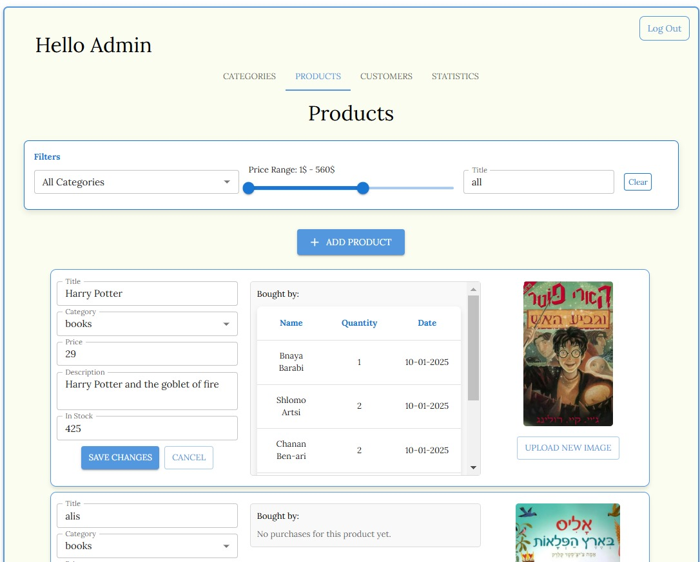
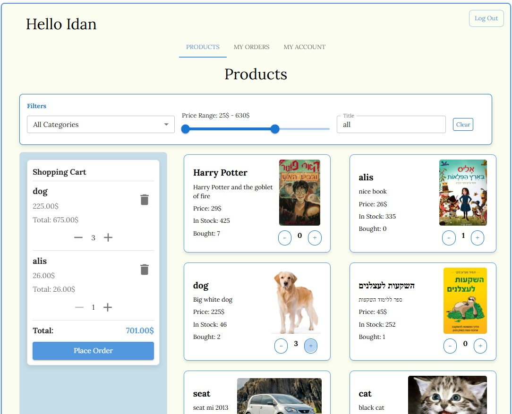

# **Online Store Platform: Admin and User Features**

An admin panel for managing products and users in an online store, 
alongside a user interface for registering and purchasing products.  
Built using **React**, **Firebase**, and **Material UI** for seamless and responsive design.

---


## **Features**
- Real-time database updates with Firebase.
- Intuitive and responsive interface using Material UI.
- **Two Modes of Operation:**
  - **Admin Mode:**
    - Add, update, and delete products.
    - Manage inventory efficiently.
### Admin Page


  - **User Mode:**
    - Register and log in to the platform.
    - Browse and purchase products seamlessly.
### Customer Page



---

## **Login Credentials**
- **Admin Username:** `gilad1`  
- **Admin Password:** `12345678`  

> **Note:** Use these credentials to access admin features in the application.

---

## **Getting Started**

### **Installation**
1. Clone the repository:
   ```bash
   git clone https://github.com/yourusername/OnlineStore.git
   cd OnlineStore
   ```

2. Install dependencies:
   ```bash
   npm install
   ```

3. Start the development server:
   ```bash
   npm start
   ```

---

## **Technologies Used**
- **React**: For building the user interface.
- **Firebase**: For real-time database and authentication.
- **Material UI**: For responsive and styled components.

---

## **Project Structure**
```
OnlineStore/
├── src/
│   ├── adminMode/
│   │   │── ...
│   ├── userMode/
│   │   └── ...
│   ├── logIn/
│   │   └── ...
│   ├── redux/
│   │   └── ...
│   ├── firebaseConfig.js
│   └── App.jsx
├── public/
└── package.json
```

## **License**
This project is licensed under the MIT License.
